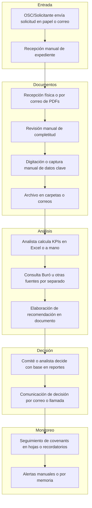
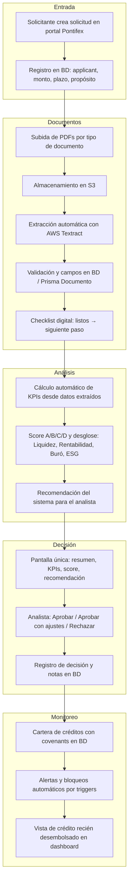
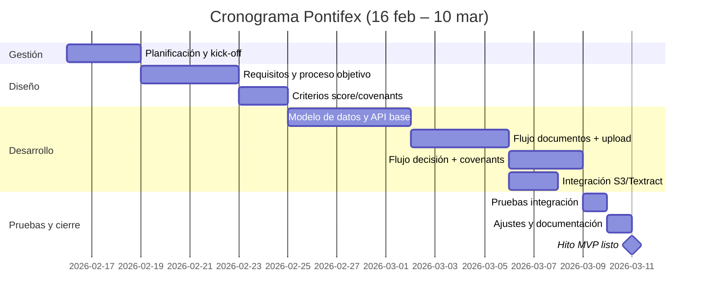

# Proyecto Pontifex — Transformación digital del proceso de evaluación crediticia

Documento de proyecto para la transformación digital del proceso clave seleccionado en el marco de Financiación del Desarrollo Sostenible.

---

## 1. Proceso clave seleccionado para transformar digitalmente

**Proceso:** Evaluación crediticia integral (solicitud → análisis documental → decisión → monitoreo post-desembolso).

Se ha seleccionado el **ciclo completo de evaluación y seguimiento crediticio** que incluye:

- Recepción y registro de solicitudes de financiamiento.
- Recolección y validación de documentos soporte (estados financieros, actas, declaraciones fiscales, etc.).
- Análisis de la información para generar indicadores (KPIs), score de crédito (A/B/C/D) y recomendación.
- Decisión del analista (aprobar / aprobar con ajustes / rechazar).
- Monitoreo post-desembolso mediante covenants (DSCR, Deuda/EBIT, capital de trabajo, mora) con alertas y posibles bloqueos.

Este proceso es crítico porque concentra los tres problemas principales del reto: **datos confiables desde documentos**, **decisiones humanas consistentes** y **monitoreo post-desembolso**.

---

## 2. Diagrama de proceso de las operaciones en el estado actual

Flujo típico **antes** de la transformación (manual o semimanual):

**Características del estado actual:**  
Datos dispersos, captura manual, poca trazabilidad, riesgo de inconsistencias entre analistas, seguimiento de covenants dependiente de recordatorios manuales.

---

## 3. Diagrama de proceso de las operaciones después de la transformación digital

Flujo **con Pontifex** (digital):

**Características del estado objetivo:**  
Un solo flujo digital (Documentos → Evaluación y decisión → Monitoreo de covenants), datos centralizados, extracción y score automatizados, decisión informada y trazable, monitoreo con alertas automáticas.

---

## 4. Objetivos a alcanzar con la transformación digital del proceso

| #   | Objetivo                                                                                                                                                                                         |
| --- | ------------------------------------------------------------------------------------------------------------------------------------------------------------------------------------------------ |
| 1   | **Datos confiables desde documentos:** Carga digital de PDFs, extracción automática (OCR/Textract), validación y almacenamiento estructurado para reducir errores de captura y duplicidad.       |
| 2   | **Decisiones humanas consistentes:** Score de crédito (A/B/C/D), KPIs calculados y recomendación del sistema en una sola pantalla para que el analista tome decisiones alineadas y documentadas. |
| 3   | **Monitoreo post-desembolso:** Covenants (DSCR, Deuda/EBIT, capital de trabajo, mora) en sistema con alertas y bloqueos automáticos para detectar desvíos a tiempo.                              |
| 4   | **Trazabilidad y auditoría:** Registro de solicitudes, documentos, decisiones y estado de covenants en base de datos para auditoría y reportes.                                                  |
| 5   | **Eficiencia operativa:** Reducir tiempos de análisis documental y de preparación de comité mediante automatización de extracción y cálculos.                                                    |

---

## 5. Roles de los participantes en el proyecto*

*Valores sugeridos; la organización debe ajustarlos a su estructura real.*

| Rol                                   | Responsabilidad                                                                                                                |
| ------------------------------------- | ------------------------------------------------------------------------------------------------------------------------------ |
| **Sponsor / Responsable del proceso** | Aprobación de alcance, prioridades y recursos; validación de reglas de negocio (score, covenants).                             |
| **Analista de crédito**               | Uso diario del flujo: revisión de documentos extraídos, toma de decisión (aprobar/ajustes/rechazar), notas de análisis.        |
| **Administrador de solicitudes**      | Alta de solicitudes, seguimiento del checklist documental, gestión de expedientes.                                             |
| **Desarrollador / Equipo técnico**    | Desarrollo y mantenimiento del MVP: frontend (React/Vite), backend (Express), BD (PostgreSQL/Prisma), integración S3/Textract. |
| **Usuario de monitoreo**              | Revisión de cartera, covenants y alertas; actuación ante incumplimientos.                                                      |
| **OSC / Solicitante**                 | Uso del portal para crear solicitudes y subir documentos (si se habilita acceso externo).                                      |

---

## 6. Listado de lo que no está incluido en el proyecto*

*Alcance explícitamente fuera del MVP actual.*

- **Autenticación y autorización:** No hay login, roles ni control de acceso; el MVP es abierto en entorno controlado.
- **Módulo de desembolso:** No se registra el desembolso efectivo ni la dispersión de fondos; solo la decisión y el monitoreo de covenants.
- **Integración con Buró de Crédito:** El score puede considerar “Buró” en el modelo, pero no hay integración real con proveedores externos de Buró en el MVP.
- **Firma electrónica de contratos:** No está incluida la firma de contratos ni anexos.
- **Comunicación automática al solicitante:** No hay envío de correos o notificaciones al solicitante (estado de solicitud, documentos faltantes, decisión).
- **Reportes gerenciales / BI:** No hay módulo de reportes, dashboards ejecutivos ni exportación masiva para dirección.
- **Matching con proveedores de financiamiento:** La pantalla de “Proveedores compatibles” en el flujo es ilustrativa; no hay integración real con plataformas de fondeo.
- **Múltiples productos o líneas de crédito:** El modelo está orientado a un flujo tipo “solicitud única”; no hay catálogo de productos ni condiciones por producto.
- **Histórico de cambios y versionado de documentos:** No hay historial de versiones de documentos ni de cambios en decisiones.

---

## 7. Diagrama Project Breakdown Structure (WBS)

```mermaid
flowchart TB
    P[Proyecto Pontifex - Transformación digital]
    P --> P1[1. Gestión del proyecto]
    P --> P2[2. Diseño y requisitos]
    P --> P3[3. Desarrollo del producto]
    P --> P4[4. Datos e integraciones]
    P --> P5[5. Pruebas y despliegue]

    P1 --> P1_1[1.1 Planificación y seguimiento]
    P1 --> P1_2[1.2 Comunicación y stakeholders]
    P1 --> P1_3[1.3 Gestión de riesgos]

    P2 --> P2_1[2.1 Definición del proceso objetivo]
    P2 --> P2_2[2.2 Requisitos funcionales]
    P2 --> P2_3[2.3 Criterios de score y covenants]
    P2 --> P2_4[2.4 Tipos de documento y validación]

    P3 --> P3_1[3.1 Frontend: flujo solicitud → decisión → covenants]
    P3_1 --> P3_1a[Landing y alta de solicitud]
    P3_1 --> P3_1b[Checklist documentos y subida]
    P3_1 --> P3_1c[Pantalla evaluación y decisión]
    P3_1 --> P3_1d[Pantalla monitoreo covenants]
    P3 --> P3_2[3.2 Backend API: applications, documentos, score, KPIs]
    P3 --> P3_3[3.3 Modelo de datos y migraciones]
    P3 --> P3_4[3.4 Integración subida S3 + Textract]

    P4 --> P4_1[4.1 Esquema BD PostgreSQL]
    P4 --> P4_2[4.2 Prisma: Empresa, Documento]
    P4 --> P4_3[4.3 Seed y datos de prueba]
    P4 --> P4_4[4.4 Configuración AWS S3 y Textract]

    P5 --> P5_1[5.1 Pruebas funcionales del flujo]
    P5 --> P5_2[5.2 Pruebas de integración API]
    P5 --> P5_3[5.3 Despliegue y documentación]
```

**Resumen por paquete:**

| WBS | Descripción breve                                                                         |
| --- | ----------------------------------------------------------------------------------------- |
| 1   | Gestión del proyecto (planificación, comunicación, riesgos).                              |
| 2   | Diseño y requisitos (proceso objetivo, criterios de score/covenants, tipos de documento). |
| 3   | Desarrollo (frontend flujo completo, backend API, modelo de datos, S3/Textract).          |
| 4   | Datos e integraciones (esquema BD, Prisma, seed, AWS).                                    |
| 5   | Pruebas y despliegue (funcional, API, despliegue y documentación).                        |

---

## 8. Cronograma del Proyecto con hitos y responsables*

*Cronograma del proyecto: 16 de febrero – 10 de marzo.*

| Hito | Descripción                                                         | Responsable*                     | Fecha objetivo |
| ---- | ------------------------------------------------------------------- | -------------------------------- | -------------- |
| H0   | Kick-off y plan base aprobada                                       | Sponsor / Jefe de proyecto       | 16 feb 2026    |
| H1   | Requisitos y criterios de score/covenants definidos                 | Responsable de proceso + Técnico | 24 feb 2026    |
| H2   | API y modelo de datos operativos (applications, documentos)         | Equipo técnico                   | 1 mar 2026     |
| H3   | Flujo completo funcional (documentos → decisión → covenants) en dev | Equipo técnico                   | 8 mar 2026     |
| H4   | Integración S3 + Textract validada                                  | Equipo técnico                   | 7 mar 2026     |
| H5   | Pruebas funcionales e integración completadas                       | Analista + Técnico               | 9 mar 2026     |
| H6   | MVP listo para uso piloto                                           | Proyecto                         | 10 mar 2026    |

 Ajustar responsables y fechas según la organización.

---

*Documento generado a partir del código y documentación del repositorio Pontifex (MVP). Para uso en el marco de Transformación digital de organizaciones de la sociedad civil.*